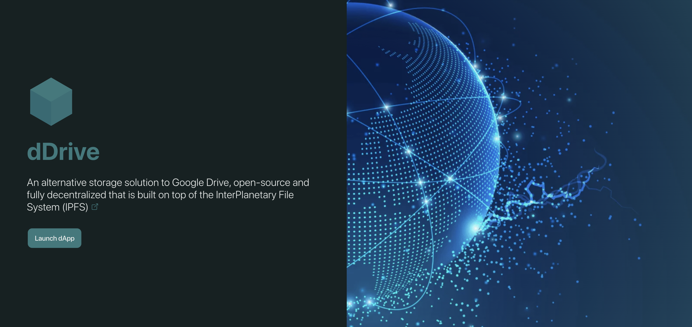

# dDrive - Decentralized Drive System 

> An alternative storage solution to Google Drive, open-source and fully decentralized that is built on top of the InterPlanetary File System (IPFS) 

Launch dDrive PWA with Valist distribution software [https://app.valist.io/d-drive/d-drive-pwa](https://app.valist.io/d-drive/d-drive-pwa)

## Project Description
dDrive is a fully decentralized and open-source Storage solution which replace traditional storage providers having centralized governance, cumbersome infrastructure, inadequate security and privacy measures with users datasets. 

dDrive is build on top of IPFS and inherits all the features of Blockchain Technology to emerge as an immutable, censorship-resistant, tamper-proof and privacy complient with user dataset.

## Value Proposition
dDrive integrat IPFS Core powered by Filecoin to enable users to store, manage and share their files in a decentralized way. Few of the core value propositions are:

- Increased User Adoption: 
  Providing a smooth and intuitive process with seamless user experience to store, manage and share files in a decentralized way will increase the adoption of IPFS and Filecoin.

- Real-world utility: 
  dDrive provide a real-world utility for censorship-resistant, tamper-proof and privacy complient storage solution by providing multi services composition that allow users to store and share files with total privacy and security controls of data access by using Encryption and Decryption technologies to increase data acces security.

## 👀 Overview



## 🚀 Features

**File Management**

  - [x] Create folder
  - [x] Delete folder
  - [x] Rename folder
  - [x] Move folder
  - [x] List files from folder
  - [x] Search files in folder
  - [x] Upload files to specific folder
  - [x] Download file
  - [x] Delete file
  - [x] Rename file
  - [x] Move file
  - [x] Share file with public url link
  - [x] Share file with custom access controls
  - [x] Preview file in app

**NFTs Management**

  - [x] List NFTs from connected wallet
  - [x] Search NFTs by name
  - [x] Filter NFTs by chain

**Others**

  - [x] Dark mode support
  - [x] Multi chain support
  - [x] Shared file Notifications
  - [x] File encryption 
  - [x] File access control with wallet address
  - [x] Desktop app support using PWA technology

## Technology Stack

- [IFPS Core](https://js.ipfs.tech) Browser implementation of the IPFS protocol to manage files storage and retrieval to IPFS network 
- [Ceramic](https://ceramic.network) Decentralized database to manage storage metadata files and user profile data
- [Lit Protocol](https://litprotocol.com) Decentralized Cryptography Access Control service to encrypt files and manage access control
- [XMTP](https://xmtp.org/) Decentralized messaging service to manage in app notifications
- [Ceramic 3id Connect](https://github.com/ceramicstudio/js-3id) Decentralized authentication service to manage user identity
- [Ethersjs](https://docs.ethers.io/v5/) Ethereum SDK to manage Web3 wallet connection and account management 
- [Moralis NFT API](https://moralis.io) SDK to manage NFTs from Evm networks
- [Valist](https://app.valist.io/) Software distribution tool to manage releases and updates hosted on IPFS

## Usage & Installation

dDrive is a web application that can be used in any modern browser that have a [Metamask](https://metamask.io/download.html) Extension install. 

You can also install dDrive as a desktop application using Progressive Web App (PWA) technology by click `install` icon from browser url section or from `options` section of your browser. You can find more informations about PWA installation and specification [here](https://developer.mozilla.org/en-US/docs/Web/Progressive_web_apps/Add_to_home_screen).

**Distribution link to install dDrive PWA application:** [https://app.valist.io/d-drive/d-drive-pwa](https://app.valist.io/d-drive/d-drive-pwa)

## How it's built

### Authentication: 3id Connect & Etherjs

dDrive use 3id Connect to manage user identity and Etherjs to manage Web3 wallet connection and account management. 

<details>
  <summary><b>Click to toggle contents of `code` implementaion</b></summary>

  ```typescript
  export class DIDService {

    async init(ethereumProvider: any) { 
      if (this.did) {
        return this.did;
      }
      this.web3Provider = new ethers.providers.Web3Provider(ethereumProvider, 'any');
      // Request accounts from the Ethereum provider
      const accounts = await this.web3Provider
        .send('eth_requestAccounts', [])
        .catch((err: any) => {
          throw `Error during Web3 Authetication: ${err?.message||'Unknown error'}`;
        });
      if ((accounts?.length||0) === 0) {
        throw 'No accounts found. Please unlock your Ethereum account, refresh the page and try again.';
      }
      const { chainId =  (await this.web3Provider?.getNetwork())?.chainId} = (this.web3Provider.provider as any);
      if (!chainId) {
        throw 'No chainId found. Please unlock your Ethereum account, refresh the page and try again.';
      }
      this.chainId$.next(chainId.replace('0x', ''));
      // listen event from provider
      this._listenEvent(this.web3Provider);
      // Create an EthereumAuthProvider using the Ethereum provider and requested account
      const account: string = accounts[0];
      this.accountId$.next(account);
      this.did = new DID();
      return this.did;
    }

    async connect() {
      const authProvider = new EthereumAuthProvider(this.web3Provider.provider, this.accountId$.value);
      // Connect the created EthereumAuthProvider to the 3ID Connect instance so it can be used to
      // generate the authentication secret
      const threeID = new ThreeIdConnect()
      await threeID.connect(authProvider);
      // Set the DID provider from the 3ID Connect instance
      this.did.setProvider(threeID.getDidProvider());
    }
  }
  ```

  >  full implementation can be found here: [./apps/browser/src/app/services/did.service.ts](./apps/browser/src/app/services/did.service.ts)

</details>
<hr/>

### Database: Ceramic Network

dDrive use Ceramic Network to manage storage metadata files and user profile data.

<details>
  <summary><b>Click to toggle contents of `code` implementaion</b></summary>

  ```typescript
  export class CeramicService {

    private readonly _db: CeramicClient = new CeramicClient(environment.ceramic.apiHost);
    private readonly _datastore: DIDDataStore = new DIDDataStore({ ceramic: this._db, model: this._getAliases() });
  

    async getAll() {
      if (!this._db?.did) {
        throw 'No DID found';
      }
      const {dDrive: {documentID = null} = {}} = await this._getProfileFromCeramic()||{};
      if (!documentID) {
        throw new Error('No documentID found');
      }
      this._mainDocuumentId = documentID;
      const datas = await this.getData(documentID);
      return datas;
    }

    async saveData(data: {
      [key: string|number]: any;
    }) {
      if (!this._db?.did) {
        throw 'No DID found';
      }
      const doc = await TileDocument.create(this._db, data);
      const _id = doc.id.toString();
      // The stream ID of the created document can then be accessed as the `id` property
      return {_id};
    }

    async updateData(data: {
      [key: string|number]: any;
    }, docId?: string) {
      if (!data?.['_id'] && !docId) {
        throw new Error('No _id found');
      }
      if (!this._db?.did) {
        throw 'No DID found';
      }
      data['lastModifiedIsoDateTime'] =  new Date().toISOString();
      const doc = await TileDocument.load(this._db, docId||data['_id']);
      await doc.update(data);
      return {
        ...doc.content as any,
      };
    }

    async getData(key: string) {
      if (!this._db?.did) {
        throw 'No DID found';
      }
      const doc = await TileDocument.load(this._db, key);
      return {
        ...doc.content as any,
        _id: doc.id.toString()
      };
    }

    async updateUserProfil(value: Partial<IUserProfil>) {
      if (!this._db?.did) {
        throw 'No DID found';
      }
      const {dDrive: {documentID = null, ...previousProfilData} = {}} = await this._getProfileFromCeramic()||{};
      if (!documentID) {
        throw new Error('No documentID found');
      }
      // save the document `id` to the profile data
      const dDrive: IUserProfil = {
        ...previousProfilData,
        ...value,
        latestConnectionISODatetime: new Date().toISOString(),
        documentID,
      } as IUserProfil;
      const updatedProfil = { dDrive };
      await this._datastore.merge('BasicProfile', updatedProfil);
      return updatedProfil;
    }
   
    private async _setupProfile() {
      // create Document to store all files data
      const doc = await TileDocument.create(this._db, {
        files: [],
        lastModifiedIsoDateTime: new Date().toISOString()
      });
      // save the document `id` to the profile data
      const dDrive: IUserProfil = {
        latestConnectionISODatetime: new Date().toISOString(),
        creationISODatetime: new Date().toISOString(),
        documentID: doc.id.toString(),
      };
      await this._datastore.merge('BasicProfile', { dDrive });
      return dDrive;
    }
  }
  ```
  
  > full implementation can be found here: [./apps/browser/src/app/services/ceramic.service.ts](./apps/browser/src/app/services/ceramic.service.ts)
  
</details> 
<hr/>

### File Storage: IPFS-Core

dDrive use IPFS-Core to manage file storage.

<details>
  <summary><b>Click to toggle contents of `code` implementaion</b></summary>

  ```typescript
  export class IPFSService {
    private _ipfsNode!: IPFS;

    async disconect() {
      if (this._ipfsNode) {
        await this._ipfsNode.stop();
      }
    }

    async add(file: File | Blob) {
      if (!this._ipfsNode) {
        this._ipfsNode = await create();
      }
      const nodeIsOnline = this._ipfsNode.isOnline();
      if (!nodeIsOnline) {
        throw new Error('IPFS node is not online');
      }
      const { cid } = await this._ipfsNode.add(file, {
        timeout: 10000,
        preload: true,
        progress: (prog) => console.log(`received: ${prog}`),
      });
      // default cll pin method
      await this.pin(cid.toString());
      return {
        cid: cid.toString()
      };
    }

    async pin(cid: string) {
      if (!this._ipfsNode) {
        this._ipfsNode = await create();
      }
      const nodeIsOnline = this._ipfsNode.isOnline();
      if (!nodeIsOnline) {
        throw new Error('IPFS node is not online');
      }
      await this._ipfsNode.pin.add(cid, {
        timeout: 10000,
      });
    }

    async unpin(cid: string) {
      if (!this._ipfsNode) {
        this._ipfsNode = await create();
      }
      const nodeIsOnline = this._ipfsNode.isOnline();
      if (!nodeIsOnline) {
        throw new Error('IPFS node is not online');
      }
      await this._ipfsNode.pin.rm(cid, {
        timeout: 10000,
      });
    }

    async getFromCID(cid: string, type?: string): Promise<File> {
      if (!this._ipfsNode) {
        this._ipfsNode = await create();
      }
      const nodeIsOnline = this._ipfsNode.isOnline();
      if (!nodeIsOnline) {
        throw new Error('IPFS node is not online');
      }
      const asyncUint8Array = this._ipfsNode.cat(cid, {
        timeout: 10000,
        preload: true,
      });
      const blobsPart = [];
      for await (const chunk of asyncUint8Array) {
        blobsPart.push(chunk);
      }
      const file = new File(blobsPart, cid, { type });
      return file;
    }
  }
  ```

  > full implementation can be found here: [./apps/browser/src/app/services/ipfs.service.ts](./apps/browser/src/app/services/ipfs.service.ts)
  
</details>
<hr/>

### Cryptography Access Control: lit Protocol

dDrive use lit Protocol to encrypt datas saving to IPFS and manage access control datas to enable users to share mediafile with other users have supported blockain wallet address.

<details>
  <summary><b>Click to toggle contents of `code` implementaion</b></summary>

  ```typescript
  export class LitService {

    private async _connect() {
      const client: { connect: () => Promise<void> } = new LitJsSdk.LitNodeClient(
        { debug: false }
      );
      await client.connect();
      this._litNodeClient = client;
    }

    async encrypt(
      file: File | Blob,
      accessControlConditions: IAccessControlConditions[],
      chain = this._chain
    ): Promise<{
      encryptedFile: Blob;
      encryptedSymmetricKey: string;
    }> {
      if (!this._litNodeClient) {
        await this._connect();
      }
      if (!this._authSig) {
        this._authSig = await this._getAuthSig(chain);
      }
      const { encryptedFile, symmetricKey } = await LitJsSdk.encryptFile({
        file: file,
      });

      const encryptedSymmetricKey = await this._litNodeClient.saveEncryptionKey({
        accessControlConditions,
        symmetricKey,
        authSig: this._authSig,
        chain,
        permanent: false,
      });
      return {
        encryptedFile,
        encryptedSymmetricKey: LitJsSdk.uint8arrayToString(
          encryptedSymmetricKey,
          'base16'
        ),
      };
    }

    async decrypt(
      encryptedFile: File | Blob,
      encryptedSymmetricKey: string,
      accessControlConditions: IAccessControlConditions[],
      chain = this._chain
    ): Promise<{ decryptedArrayBuffer: ArrayBuffer }> {
      if (!this._litNodeClient) {
        await this._connect();
      }
      if (!this._authSig) {
        this._authSig = await this._getAuthSig(chain);
      }
      const symmetricKey = await this._litNodeClient.getEncryptionKey({
        accessControlConditions,
        toDecrypt: encryptedSymmetricKey,
        chain,
        authSig: this._authSig,
      });
      const decryptedArrayBuffer: ArrayBuffer = await LitJsSdk.decryptFile({
        symmetricKey: symmetricKey,
        file: encryptedFile,
      });
      return { decryptedArrayBuffer };
    }

    async disconnect() {
      if (!this._litNodeClient) {
        return;
      }
      await LitJsSdk.disconnectWeb3();
      this._litNodeClient = null;
      this._authSig = null;
    }
  }
  ```

  > full implementation can be found here: [./apps/browser/src/app/services/lit.service.ts](./apps/browser/src/app/services/lit.service.ts)
  
</details>  
<hr/>

### Notifications: XMTP Protocol

dDrive use XMTP Protocol to send notifications to users when they receive new shared mediafile from other users.

<details>
  <summary><b>Click to toggle contents of `code` implementaion</b></summary>

  ```typescript
  export class XMTPService {

    async init(web3Provider: ethers.providers.Web3Provider, opts?: ListMessagesOptions | undefined) {
      this._web3Provider = web3Provider;
      // Create the client with your wallet.
      // This will connect to the XMTP development network by default
      const xmtp = await Client.create(this._web3Provider.getSigner());
      this._xmtp.next(xmtp);
      const {conversations = []} = await this.getConversations();
      this._conversations.next(conversations);
      const messages = await this.getPreviousMessagesFromExistingConverstion(opts);
      this.messages$.next(messages);
      this._listenAllUpcomingMessages();
      return xmtp;
    }

    async disconnect() {
      const xmtp = this._xmtp.getValue();
      if (!xmtp) {
        return;
      }
      await xmtp.close();
      this._xmtp.next(null as any);
    }

    async getConversations() {
      if (!this._web3Provider) {
        throw '{XMTPService} Web3Provider not found. Please unlock your Ethereum account, refresh the page and try again.';
      }
      let xmtp = this._xmtp.getValue();
      if (!xmtp) {
        xmtp = await this.init(this._web3Provider);
      }
      const conversations = await xmtp.conversations.list();
      return { conversations };
    }

    async getPreviousMessagesFromExistingConverstion(
      opts?: ListMessagesOptions | undefined
    ): Promise<IXMTPMessage[]> {
      const xmtp = this._xmtp.value;
      const messages = [];
      const conversations = this._conversations.getValue();
      for (const conversation of conversations) {
        // All parameters are optional and can be omitted
        opts = opts
          ? opts
          : {
              // Only show messages from last 24 hours
              startTime: new Date(new Date().setDate(new Date().getDate() - 1)),
              endTime: new Date(),
            };
        // get messages from conversation
        const messagesInConversation = await conversation
          .messages(opts)
          .then((messages) => {
            // filter out messages from self and return
            return messages.filter(
              (message) => message.senderAddress !== xmtp.address
            );
          });
        // add conversation and messages to messages array
        if (messagesInConversation.length > 0) {
          messages.push({
            conversation,
            messagesInConversation,
          });
        }
      };
      return messages;
    }

    async sendMessage(conversation: Conversation, message: string) {
      if (!this._web3Provider) {
        throw '{XMTPService} Web3Provider not found. Please unlock your Ethereum account, refresh the page and try again.';
      }
      await conversation.send(message);
    }

    async startNewConversation(address: string) {
      if (!this._web3Provider) {
        throw '{XMTPService} Web3Provider not found. Please unlock your Ethereum account, refresh the page and try again.';
      }
      let xmtp = this._xmtp.getValue();
      if (!xmtp) {
        xmtp = await this.init(this._web3Provider);
      }
      const conversation = await xmtp.conversations
        .newConversation(address)
        .catch((e) => {
          throw e?.message || `Failed to start conversation with ${address}`;
        });
      // this._addListener(conversation);
      this._conversations.next([...this._conversations.getValue(), conversation]);
      return { conversation };
    }

    private async _listenAllUpcomingMessages() {
      if (!this._web3Provider) {
        throw '{XMTPService} Web3Provider not found. Please unlock your Ethereum account, refresh the page and try again.';
      }
      const xmtp = this._xmtp.value;
      // Listen for new messages in existing conversations and new conversations
      const streamAllMessages = await xmtp.conversations.streamAllMessages();
      for await (const message of streamAllMessages) {
        // filter out messages from self
        if (message.senderAddress !== xmtp.address) {
          this.messages$.next([
            ...this.messages$.getValue(),
            { messagesInConversation: [message] }
          ]);
        }
        break;
      }
    }
  }
  ```

  > full implementation can be found here: [./apps/browser/src/app/services/xmtp.service.ts](./apps/browser/src/app/services/xmtp.service.ts)
  
</details>
<hr/>

### NFTs: Moralis SDK

dDrive use Moralis SDK to list and manage user NFTs.

<details>
  <summary><b>Click to toggle contents of `code` implementaion</b></summary>

  ```typescript
  export class NFTService {

    async connect() {
      this._core = MoralisCore.create();
      this._evmApi = MoralisEvmApi.create(this._core);
      this._core.registerModules([this._evmApi]);
      await this._core.start({
        apiKey: environment.moralis.apiKey,
      });
    }

    async getWalletNFTs(address: string, chain: EvmChain = EvmChain.MUMBAI) {
      Moralis.start({
        apiKey: environment.moralis.apiKey
      });
      const response = await Moralis.EvmApi.nft.getWalletNFTs({
        address,
        chain,
      });    
      return response.result;
    }

    async getWalletNFTsFromAllChain(address: string) {
      const chains = this._chains;
      const nfts = await Promise.all(
        chains.map(async (chain) => this.getWalletNFTs(address, chain))
      ).then((nfts) => nfts.flat());
      this._nfts$.next(nfts);
      return nfts;
    }
  }
  ```

  > full implementation can be found here: [./apps/browser/src/app/services/nft.service.ts](./apps/browser/src/app/services/nft.service.ts)

</details>
<hr/>

### Distribution: Valist

dDrive is distributed using Valist. Valist is a decentralized Software distribution tool to manage releases and updates hosted on IPFS.

<details>
  <summary><b>Click to toggle contents of `code` implementaion</b></summary>

  ```yaml

      - name: Valist Deploy
      - uses: valist-io/valist-github-action@v2.5.6
        with:
          private-key: ${{ secrets.VALIST_SIGNER }}
          account: d-drive
          project: d-drive-pwa
          release: ${{ github.ref_name }}
          path: dist/apps/browser
      
  ```

  > full implementation can be found here: [.github/workflows/actions.yml](.github/workflows/actions.yml)
  
</details>
<hr/>

## Development

- Clone the dDrive repository
- Install dependencies using NodeJS and NPM
- Install Nx Workspace CLI to manage workspace project
- Run developpment server using `nx serve` command will open the dDrive application in the browser
- This project was generated using [Nx Workspace](https://nx.dev).

## Build
- Run `nx build` to build the dDrive application for the browser as PWA. 

The build artifacts will be stored in the `dist/` directory.

## Deployment 

dDrive is deployed automatically using Github Actions. Every commit to the `main` branch will trigger a new deployment.

## Documentation

- Run `npm run docs:browser` to generate the appplication documentation

The documentation will be generate in the `dist/` directory. Open the `dist/compodoc/browser/index.html` file in browser to see the documentation as website.

## Environment Variables

Environment variables are set in the `.env` file in the root of the project. The following variables are required:

  - `NG_APP_VERSION` - NPM Package version
  - `NG_APP_COMMIT` - Github commit hash
  - `NG_APP_MORALIS_API_KEY` - Moralis API Key
  - `NG_APP_CERAMIC_API_HOST` - Ceramic API Host

Environment variables can be update for each mode. Go to the `environment` folder and update the `environment.{MODE}.ts` file to change the environment variables for the desired mode.

## Architecture overview

The application is build using [Angular](https://angular.io) and [Ionic framework](https://ionicframework.com) to provide scalable and maintainable web application. The follder architecture is based on [Nx Workspace](https://nx.dev) to provide a configurable workspace that can contain multiple applications in the `./apps` folder and multiple libraries in the `./libs` folder. This is very useful for building large scale applications with multiple components and features that can be easily maintained and updated.

The `main` application is stored in `./apps/browser` folder and it contains files and folders organized according to Angular's best practices structure:

| File                             | Description                                                           |
|----------------------------------|-----------------------------------------------------------------------|
| `/src/app`                       | contains the application source code                                  |
| `/src/app/components`            | Components that can be reused in other components                     |
| `/src/app/containers`            | Containers pages                                                      |
| `/src/app/directives`            | Directives that are used to extend the functionality of HTML elements |
| `/src/app/guards`                | Guards that are used to protect routes                                |
| `/src/app/interfaces`            | Interfaces that are used to define the structure of objects           |
| `/src/app/pipes`                 | Pipes that are used to transform data                                 |
| `/src/app/services`              | Services that are used to provide data to the application             |
| `/src/app/app-routing.module.ts` | Application routing                                                   |
| `/src/app/app.component.ts`      | Application root component                                            |
| `/src/app/app.module.ts`         | Application root module                                               |
| `/src/assets`                    | Application assets                                                    |
| `/src/environments`              | Application environment variables                                     |
| `/src/thems`                     | Application theming variables                                         |
| `/src/index.html`                | Application HTML Entry point template                                 |
| `/src/main.ts`                   | Application Entry point template                                      |

## Contributing

Thanks for taking the time to help out and improve the project! 🎉

The following is a set of guidelines for contributions and may change over time. Feel free to suggest improvements to this document in a pull request!

See [CONTRIBUTING.md](CONTRIBUTING.md)

## License

Project is Open Source and available under the [MIT License](LICENSE).

## Team

- [**@fazionico**](https://github.com/FazioNico) - **Nicolas Fazio** 
  
  Software Architect & Blockchain Developer

  Mr. Fazio is a software architect and blockchain developer with over 15 years of industry experience. He has worked on a variety of projects ranging from cloud enterprise software to blockchain applications focusing last 3 years exclusively in the Web 3 industry. He is passionate about building decentralized solutions and is currently working on the dDrive project.

  LinkedIn: [https://www.linkedin.com/in/fazio-nicolas/](https://www.linkedin.com/in/fazio-nicolas/)

## Support

If you like this project, please consider supporting it by giving a ⭐️
